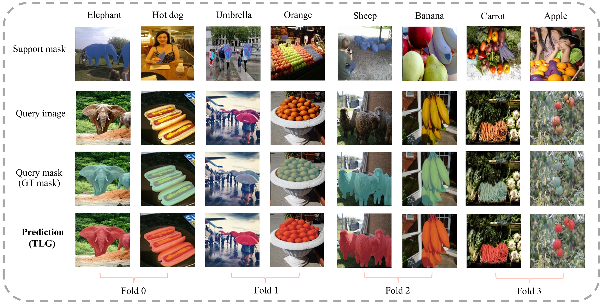

The code will be uploaded after the paper is accepted.

-----------------------------------------------------------

Due to page limitations in the submitted manuscript, we have omitted some experimental results and provide them here as a supplement. These contents will be incorporated into the manuscript in the revised version.

-----------------------------------------------------------
## TLG Multi-Object Segmentation Visualization

 

This section provides a systematic evaluation of the TLG model's performance in multi-object segmentation scenarios. Compared to single-object segmentation, multi-object segmentation places higher demands on the model's contextual understanding. This is primarily due to the inherent attention bias of convolutional neural networks, which tend to prioritize salient object features in the image. This characteristic not only tests the model's ability to integrate multi-scale spatial information but also presents a significant challenge in modeling the interactions between objects in complex scenes. 

As shown in the figure above, we systematically evaluate TLG's multi-object segmentation performance across different folds of the COCO-20\textsuperscript{i} datasets. In the first column (left to right) depicting the \textit{elephant} category, TLG demonstrates robust anti-occlusion capabilities by accurately segmenting both primary targets and partially obscured contours. In the third column, under the \textit{umbrella} category, multiple umbrellas diminish in size from foreground to background, exhibiting significant spatial depth. TLG adeptly segments these smaller targets, demonstrating its robust spatial modeling capabilities. Similarly, in the fifth column featuring the \textit{sheep} category, the lower portion of the image is dimly lit, obscuring object details. Nonetheless, TLG accurately segments multiple sheep, highlighting its proficiency in multi-scale feature fusion and semantic understanding. Finally, when evaluating densely stacked targets such as \textit{orange} and \textit{carrot}, TLG maintains clarity and precision in segmentation, underscoring its strong robustness.
