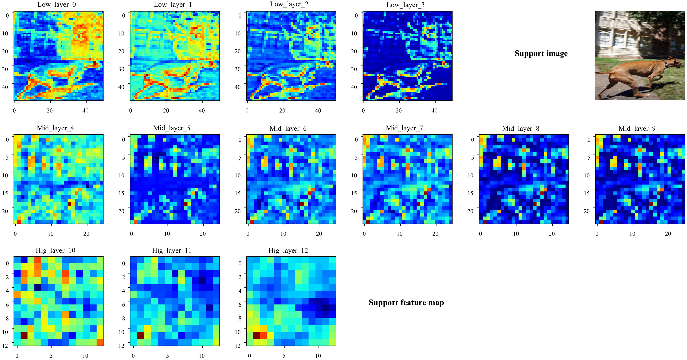
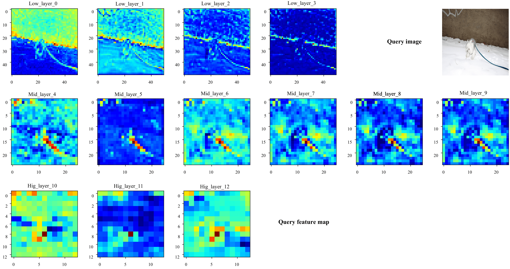
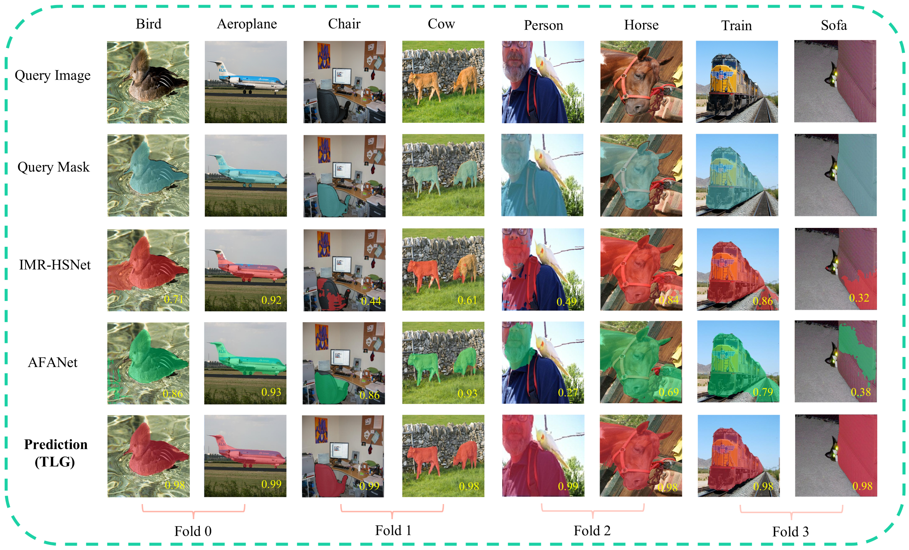
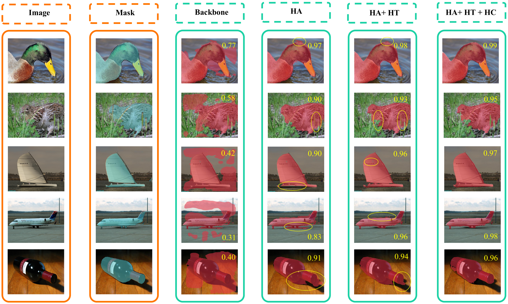

The code will be uploaded after the paper is accepted.

## Abstract

 

Figure 10. Multi-Objective Qualitative Visualization Analysis：Visualizing Segmentation Results under a 1-Shot Setting on the COCO-20i Datasets. Each pair of columns corresponds to a fold in the meta-learning paradigm.

## Abstract

 

Figure 10. Multi-Objective Qualitative Visualization Analysis：Visualizing Segmentation Results under a 1-Shot Setting on the COCO-20i Datasets. Each pair of columns corresponds to a fold in the meta-learning paradigm.

## Abstract

 

Figure 10. Multi-Objective Qualitative Visualization Analysis：Visualizing Segmentation Results under a 1-Shot Setting on the COCO-20i Datasets. Each pair of columns corresponds to a fold in the meta-learning paradigm.

## Abstract

 

Figure 11. Comparative Qualitative Visualization Analysis with State-of-the-Art Models: Visualizing Segmentation Results under a 1-Shot Setting on the Pascal-5i Datasets. Each pair of columns corresponds to a fold in the meta-learning paradigm. The yellow numbers in the bottom right denote the Intersection over Union (IoU) scores.

## Abstract

 

Figure 12. Ablation Study via Qualitative Visual Analysis: Visualizing Segmentation Results under a 1-Shot Setting on the Pascal-5i fold 0 Datasets. From left to right, the first two columns illustrate the raw input image and its corresponding ground-truth mask. “Backbone” denotes features extracted solely from ResNet-50 for segmentation visualization. “HA” refers to the Heterogeneous Aggregation module, “HT” denotes the Heterogeneous Transport module, and “HC” represents the Heterogeneous CLIP module, respectively. The yellow numbers in the top right denote the Intersection over Union (IoU) scores. The yellow circles highlight regions of over-segmentation or under-segmentation.
