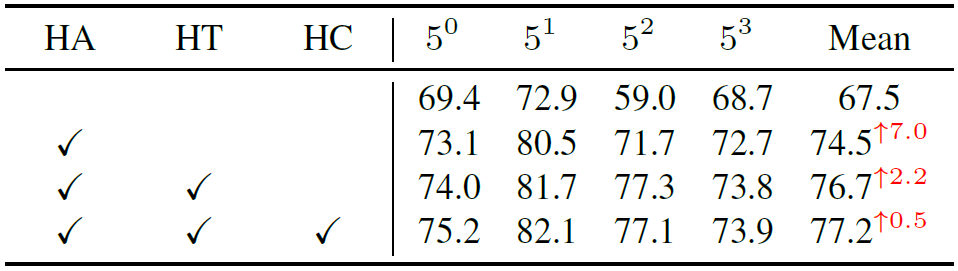
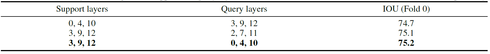

The code will be uploaded after the paper is accepted.

## Content:
 1. Revised Quantitative Analysis. ---> For Reviewer 1: nR2K
 2. Added Quantitative Analysis. ---> For Reviewer 3: W9Dn and Reviewer 4: 7h83
 3. Revised Qualitative Visualization Analysis. ---> For Reviewer 2: Q24e 
 4. Added Qualitative Visualization Analysis. ---> For Reviewer 2: Q24e and Reviewer 3: W9Dn 

## 1.Update Quantitative Analysis:

Table 3. Ablation study on various modules of TLG. The first row represents using only homogeneous features extracted by Backbone ResNet50. Following the same settings as AFANet, we set the support and query to layers 3, 9, and 12.

 

## 2.Added Quantitative Analysis:

Table 4. Ablation study on heterogeneous support and query layers. The backbone and dataset are ResNet50 and Pascal-5i, respectively.

 

## 3. Update Qualitative Visualization Analysis:

 

Figure 7. Visualization of heterogeneous features at different layers for support feature map. The first row corresponds to the low layer, while the second and third rows represent the middle layer and high layer, respectively. The upper-right displays the raw support image corresponding to the feature map.

 

Figure 8. Visualization of heterogeneous features at different layers for query feature map. The first row corresponds to the low layer, while the second and third rows represent the middle layer and high layer, respectively. The upper-right displays the raw query image corresponding to the feature map.

## 4. Added Qualitative Visualization Analysis:

 
Figure 10. Comparative Qualitative Visualization Analysis with State-of-the-Art Models: Visualizing Segmentation Results under a 1-Shot Setting on the Pascal-5i Datasets. Each pair of columns corresponds to a fold in the meta-learning paradigm. The yellow numbers in the bottom right denote the Intersection over Union (IoU) scores.

 
Figure 11. Multi-Objective Qualitative Visualization Analysis：Visualizing Segmentation Results under a 1-Shot Setting on the COCO-20i Datasets. Each pair of columns corresponds to a fold in the meta-learning paradigm.

 
Figure 12. Ablation Study via Qualitative Visual Analysis: Visualizing Segmentation Results under a 1-Shot Setting on the Pascal-5i fold 0 Datasets. From left to right, the first two columns illustrate the raw input image and its corresponding ground-truth mask. “Backbone” denotes features extracted solely from ResNet-50 for segmentation visualization. “HA” refers to the Heterogeneous Aggregation module, “HT” denotes the Heterogeneous Transport module, and “HC” represents the Heterogeneous CLIP module, respectively. The yellow numbers in the top right denote the Intersection over Union (IoU) scores. The yellow circles highlight regions of over-segmentation or under-segmentation.
