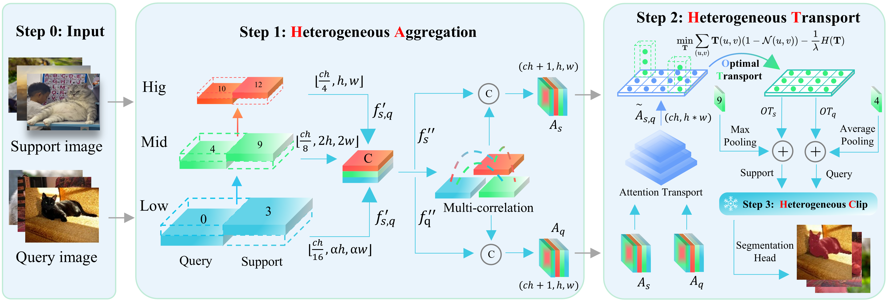
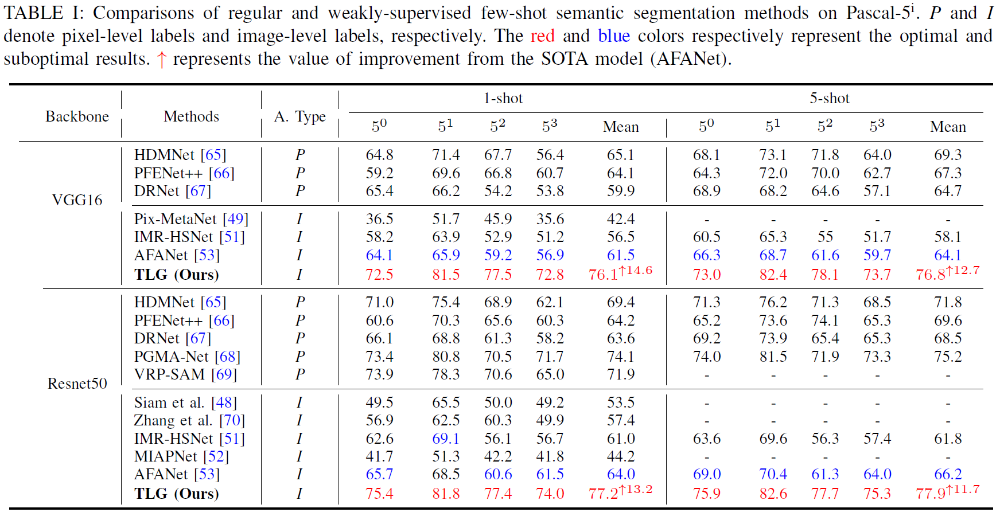
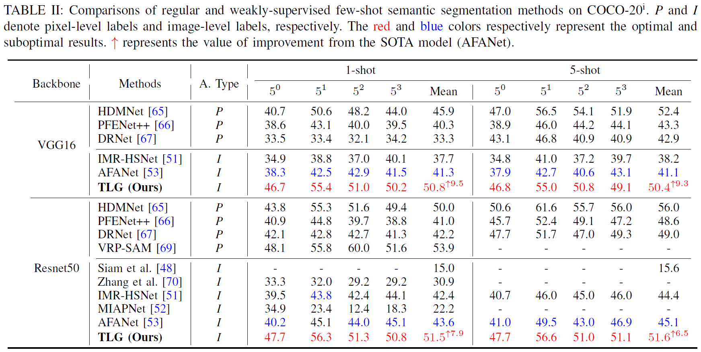

# Through the Looking Glass: A Dual Perspective on Weakly-Supervised Few-Shot Segmentation

<p align="center">
  <a href="https://arxiv.org/abs/2508.16159"></a>
</p>


<p align="center">
  <a href="https://scholar.google.com/citations?user=VtduT6sAAAAJ&hl=zh-CN">Jiaqi Ma</a><sup>1</sup> &nbsp;·&nbsp;
  <a href="https://scholar.google.com.hk/citations?user=LKaWa9gAAAAJ&hl=zh-CN&oi=ao">Guo-Sen Xie</a><sup>1</sup> &nbsp;·&nbsp;
  <a href="https://scholar.google.com.hk/citations?hl=zh-CN&user=4C7mvOwAAAAJ">Fang Zhao</a><sup>2</sup> &nbsp;·&nbsp;
  <a href="https://scholar.google.com.hk/citations?hl=zh-CN&user=L6J2V3sAAAAJ">Zechao Li</a><sup>1</sup>
</p>

<p align="center">
  <sup>1</sup> Nanjing University of Science and Technology &nbsp;&nbsp;
  <sup>2</sup> Nanjing University
</p>

## :loudspeaker: Notice
If you like this project, please ⭐ it on GitHub, Thanks!

## :fire: News

[June 24, 2026]： We have released all the code of TLG.

[June 22, 2026]： TLG is accepted by IEEE Transactions on Image Processing (TIP).

## Abstract
<div align=center></div> 

Meta-learning aims to uniformly sample homologous support-query pairs, characterized by the same categories and similar attributes, and extract useful inductive biases through identical network architectures. However, this identical network design results in over-semantic homogenization. To address this, we propose a novel homologous but heterogeneous network. By treating support-query pairs as dual perspectives, we introduce heterogeneous visual aggregation (HA) modules to enhance complementarity while preserving semantic commonality. To further reduce semantic noise and amplify the uniqueness of heterogeneous semantics, we design a heterogeneous transport (HT) module. Finally, we propose heterogeneous CLIP (HC) textual information to enhance the generalization capability of multimodal models. In the weakly-supervised few-shot semantic segmentation (WFSS) task, with only 1/24 of the parameters of existing state-of-the-art models, TLG achieves a 13.2\% improvement on Pascal-5\textsuperscript{i} and a 7.9\% improvement on COCO-20\textsuperscript{i}. To the best of our knowledge, TLG is also the first weakly-supervised (image-level) model that outperforms fully supervised (pixel-level) models under the same backbone architectures.

## Experiments
<div align=center></div> 
<div align=center></div> 

# Data Preparation

1. Create a folder named `TLG_dataset`.

2. Download the dataset from [Jarch-ma/FSS_Dataset](https://huggingface.co/datasets/Jarch-ma/FSS_Dataset) (Choose the VOC2012 and COCO2014 datasets) and simply unzip it.

---

# Environment Configuration

Please run the following commands to configure the environment:

```bash
# 1. Creating a conda environment
conda env create -n TLG python=3.10

# 2. Install torch Depend on your CUDA

# CUDA 11.8
pip install torch==2.3.1 torchvision==0.18.1 torchaudio==2.3.1 --index-url https://download.pytorch.org/whl/cu118

# 3. Install dependencies
pip install -r requirements.txt

# 5. Install SAM then delete the folder
git clone https://github.com/facebookresearch/sam2.git && cd sam2
pip install -e .
```
